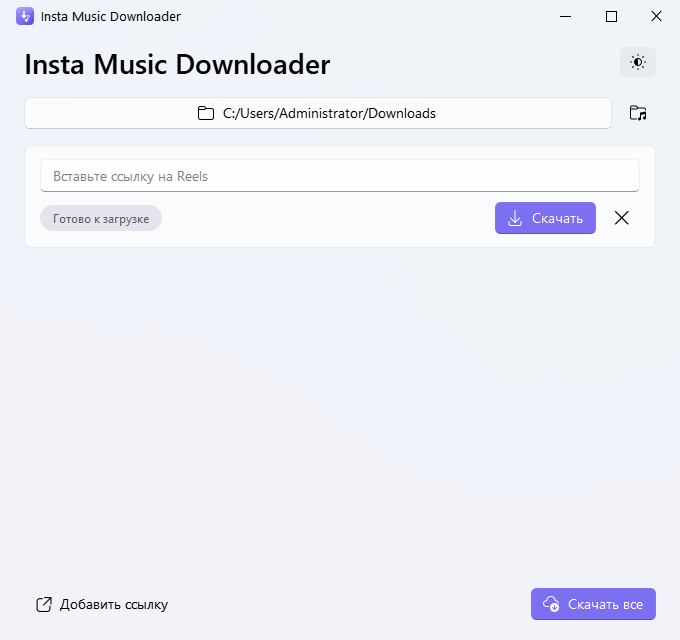
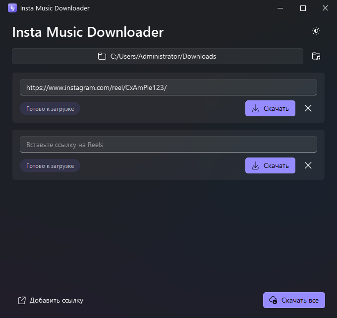

# Insta Music Downloader

🇬🇧 [Read this in English](README.en.md)

Вставляешь ссылку(и) на Instagram Reels, выбираешь папку — получаешь MP3 с
аудиодорожкой поста. По сути это GUI-обёртка над `yt-dlp -x
--audio-format mp3` с современным интерфейсом, которая не требует установки
Python, ffmpeg или чего-либо ещё — просто распаковал и запустил `.exe`.

Зачем: Instagram не даёт скачать аудио из Reels напрямую, а гонять для
этого консоль с `yt-dlp` каждый раз неудобно. Это маленький локальный
инструмент с интерфейсом в пару кликов: ссылка → папка → готовый MP3.

## Скриншоты

| Светлая тема | Тёмная тема, несколько ссылок |
| --- | --- |
|  |  |

## Возможности

- Интерфейс на Fluent Design (PySide6 + QFluentWidgets) с эффектом Mica и
  переключением светлой/тёмной темы одной кнопкой.
- Несколько ссылок одновременно: у каждой своя карточка со статусом и
  кнопкой «Скачать», плюс общая кнопка «Скачать все».
- Индикация статуса каждой загрузки (в очереди / скачивается / готово /
  ошибка) с процентом прогресса.
- Запоминает последнюю папку сохранения и подставляет её при следующем
  запуске.
- Имя файла — автоматически из заголовка поста.
- Анимированный экран загрузки при старте приложения.
- Собирается в портативную папку с `.exe` — ffmpeg и yt-dlp встроены
  внутрь, ничего дополнительно ставить на целевой машине не нужно.

## Скачать готовую сборку

Собирать самостоятельно не обязательно — на странице
[Releases](https://github.com/xQula/insta-music-downloader/releases) лежит
готовый архив: распакуй и запусти
`InstaMusicDownloader\InstaMusicDownloader.exe`.

## Запуск из исходников (разработка)

```powershell
pip install -r requirements.txt
python scripts\fetch_ffmpeg.py   # один раз — скачает ffmpeg.exe в vendor\ffmpeg
python -m app.main
```

## Сборка .exe

```powershell
.\scripts\build.cmd
```

(`build.cmd` — обёртка над `build.ps1`, которая запускает PowerShell с
`-ExecutionPolicy Bypass`; нужна, потому что на части машин выполнение
`.ps1`-скриптов отключено политикой безопасности по умолчанию. Если на твоей
машине скрипты разрешены, можно вызвать `.\scripts\build.ps1` напрямую.)

Сборка сама создаёт изолированное окружение `.venv` и ставит туда только
зависимости из `requirements.txt` — так PyInstaller не затягивает в exe
посторонние пакеты, которые могут быть установлены в системном Python.

Результат сборки: папка `dist\InstaMusicDownloader\` (сборка `--onedir`) —
копировать и переносить нужно её целиком, запускать
`dist\InstaMusicDownloader\InstaMusicDownloader.exe` внутри неё. Так
приложение запускается почти мгновенно и может показывать анимированный
экран загрузки (без распаковки во временную папку, как было бы при
`--onefile`).

## Где хранятся настройки

Последняя выбранная папка сохраняется в
`%APPDATA%\InstaMusicDownloader\config.json`.

## Ограничения

- Скачивание анонимное, без входа в аккаунт — приватные посты недоступны.
- yt-dlp зашит в exe на момент сборки. Instagram периодически меняет
  внутренний API — если скачивание перестало работать, обнови зависимость и
  пересобери exe:
  ```powershell
  pip install -U yt-dlp
  .\scripts\build.cmd
  ```

## Лицензия

[MIT](LICENSE)
